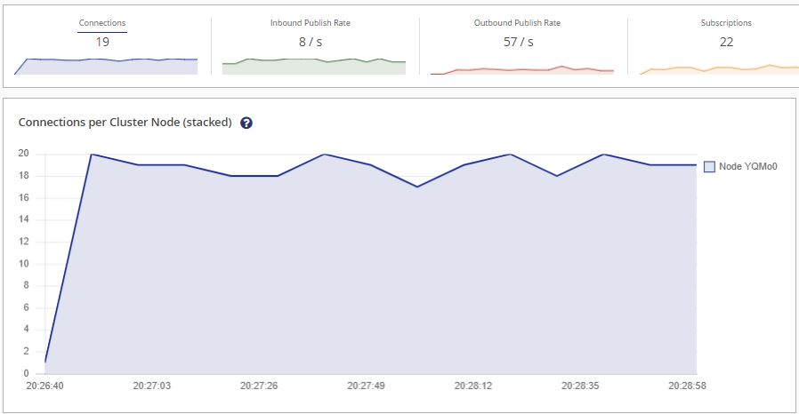

# Introduction

The broker tester is a .NET Core application to test brokers.
It is still in alpha state and has lots of improvements and enhancements to face.
The idea is that you can look at the brokers metrics to see how it reacts to a high number of clients. Clients should be able to connect, disconnect, publish, subscribe, and so on. There are mainly three parts in the configuration that you can adjust:

1. BrokerConfiguration: Sets the type of the Broker and its parameter that you want to connect to.
2. MessageBuilderConfiguration: Sets the type and behaviour of the builder that creates  the messages that will be published.
3. ClientConfiguration: Sets the behaviour of the clients that you want to connect to the broker.

This project has only been tested under Windows 10 yet.

## Prerequisites

- [Dotnet Core SDK](https://dotnet.microsoft.com/download)
- [Docker](https://docs.docker.com/get-docker/)


## Configuration

Example Configuration:

```json
{
    "TickMs": 1000,
    "TestDurationInMinutes": 3,
    "ClientCount": 20,
    "BrokerConfiguration": {
        "BrokerType": "Mqtt",
        "BrokerEndpoint": "hivemq",
        "BrokerPort": "1883",
    },
    "MessageBuilderConfiguration": {
        "MessageBuilderType": "SinusValueMessageBuilder",
        "Increment": "2",
        "Amplitude": "5",
        "StartWithRandomAngle": true,
    },
    "ClientConfiguration": {
        "ClientType": "ProbabilityClient",
        "TopicList": ["test1", "test2", "test3"],
        "ConnectProbability": 150,
        "DiscConnectProbability": 10,
        "AddSubscriptionProbability": 150,
        "RemoveSubscriptionProbability": 150,
        "PublishProbability": 500
    }
}

```

Explanation:

- **TickMs**: 1000 => Sets the time between each tick.
- **TestDurationInMinutes**: 3 => Duration in Minutes. The program will shut down after this time.
- **ClientCount**: "20" => This will create 20 clients that run in parallel.
- **BrokerConfiguration** => Configuration parameters for the broker endpoint.
- **BrokerType**: "Mqtt" => Clients will connect to a MQTT Broker
- **BrokerEndpoint**: "hivemq" => Broker address (hivemq due to the docker-compose file. For local running broker use "127.0.0.1")
- **BrokerPort**: "1883" => Connection port to the broker.
- **MessageBuilderConfiguration**: Sets configuration for the message builder. This builder creates messages that will ne published. Here I used the "SinusValueMessageBuilder".
- **MessageBuilderType**: "SinusValueMessageBuilder" => Messages will be a json with a sinus curve.
- **Increment**: "2" => Configuration for the SinusValueMessageBuilder: The increment of the sinus angle of each tick (standard = 1).
- **Amplitude**: "3" => Configuration for the SinusValueMessageBuilder: The amplitude of the curve.
- **StartWithRandomAngle**: "false" => Configuration for the SinusValueMessageBuilder: Starts with a random angle if true.
- **ClientConfiguration**: Sets configuration for the clients that will connect to the broker.
- **ClientType**: "ProbabilityBrokerClient" => Client will act on configured probabilities.
- **TopicList**: ["test1", "test2", "test3"] => A list of topics that the client can subscribe and publish to.
- **ConnectProbability**: 150 => Configuration for the ProbabilityBrokerClient: Client will connect in 150 of 1000 ticks if it is not connected.
- **DiscConnectProbability**: 10 => Configuration for the ProbabilityBrokerClient: Client will disconnect in 10 of 1000 ticks if it is connected.
- **AddSubscriptionProbability**: 150 => Configuration for the ProbabilityBrokerClient: Client will subscribe to a topic in 150 of 1000 ticks if it is connected.
- **RemoveSubscriptionProbability**: 150 => Configuration for the ProbabilityBrokerClient: Client will unsubscribe to a topic in 150 of 1000 ticks if it is connected.
- **PublishProbability**: 500 => Configuration for the ProbabilityBrokerClient: Client will publish a message (created by the SinusValueMessageBuilder) in 500 of 1000 ticks if it is connected.

## How to start

If you want to adjust how the BrokerTester operates you need to create a configuration file under /configurations.
The script deleteOldContainersBuildAndRunHiveMQ.bat should be enough to start you off. It uses the /src/docker-compose.yml and /configurations/configuration_Mqtt-Probability-Sinus.json to start two containers.
1.: brokertester => The brokertester container that starts our clients
2.: A HiveMQ Broker (MQTT) that can show us with a dashboard if everything worked out.

To check this out connect to the HiveMQ UI via browser after you started everything:
127.0.0.1:8080
User: admin
PW: hivemq

You should be seeing something like this:


## How to contribute

If you like this project you would like to help: Just add functionality. The code is designed to be very expandable.
TODO: Write explanation for this.

## Supported Brokers

* Mqtt

## Clients

* ProbabilityBrokerClient

### ProbabilityBrokerClient

This Client has a certain probability (per thousand) to connect, disconnect, etc.
Example Configuration:

```json
{
    "TickMs": 1000,
    "TestDurationInMinutes": 3,
    "ClientCount": 20,
    "BrokerConfiguration": {
        "BrokerType": "Mqtt",
        "BrokerEndpoint": "hivemq",
        "BrokerPort": "1883",
    },
    "MessageBuilderConfiguration": {
        "MessageBuilderType": "SinusValueMessageBuilder",
        "Increment": "2",
        "Amplitude": "5",
        "StartWithRandomAngle": true,
    },
    "ClientConfiguration": {
        "ClientType": "ProbabilityClient",
        "TopicList": ["test1", "test2", "test3"],
        "ConnectProbability": 150,
        "DiscConnectProbability": 10,
        "AddSubscriptionProbability": 150,
        "RemoveSubscriptionProbability": 150,
        "PublishProbability": 500
    }
}
```

## Yet to come

- Tests: Yes there will be tests
- Brokers: Kafka, Rabbitmq, Nats, (what else would you like?)
- UI: Blazor page for status and configuration
- Finished container in docker hub
- 

## Known Issues

- At Start-up there are a few connection attempts that do not work.